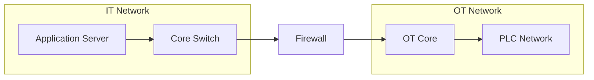

# Network Topology Generation

Use this reference when the user asks for a network topology, architecture diagram, logical network map, or a topology artifact derived from project requirements.

## Default behavior

Default to a **logical topology** unless a physical/cabling view is explicitly requested. Do not invent physical cabling, port numbers, VLAN IDs, IP addresses or redundancy that the project did not specify.

Prefer Mermaid for Markdown/GitHub-native output. Use Graphviz DOT when the user needs a format that can be rendered by Graphviz tooling or further processed programmatically.

## Input model

A topology input should describe:

- `zones`: logical/security/functional areas such as Internet, IT, DMZ, OT, management, production area, branch or data center.
- `devices`: routers, firewalls, switches, servers, storage, APs, PLC gateways, workstations, etc.
- `links`: source, target, label, speed/type/redundancy only when known.
- Optional groups/subgraphs for sites, floors, production areas or security zones.

## Rules

1. Architecture follows requirements; do not force dual core, HA firewalls, HCI or OT segmentation unless required.
2. Use clear node labels with role first; model/vendor can be secondary when relevant.
3. Separate logical zones visually.
4. Label important trust boundaries and uplinks.
5. Show redundant links only when actually required or explicitly presented as an option.
6. Never infer Internet connectivity for PLC/control networks.
7. For IT/OT projects, show firewalls/DMZ only when the selected architecture includes them.
8. For early design, prefer simple topology over a dense pseudo-CAD drawing.
9. Mark unknowns as `TBD` rather than inventing addresses, VLANs or ports.
10. If a topology is based on assumptions, include an assumptions note alongside the diagram.

## Mermaid output

Recommended:

Do not add Mermaid styling unless it improves clarity or the user requests it.

## Graphviz output

Use clusters for zones and plain directed/undirected edges for links. Keep generated DOT portable and avoid vendor-specific icons by default.

## Validation checklist

- Every link references an existing device.
- Device IDs are unique.
- Zone IDs are unique.
- No hidden architecture assumption was introduced.
- Redundancy is explicitly supported by project requirements.
- Security boundaries are consistent with the written architecture.
- Diagram and BOM use the same device roles and quantities where both are produced.

For Draw.io, approved-style preservation and rendered QA, use `references/drawio-delivery.md`. For machine-checkable cross-artifact/phase projections use `references/project-delivery.md`. Physical placement requires a qualified source, not this logical graph generator.
